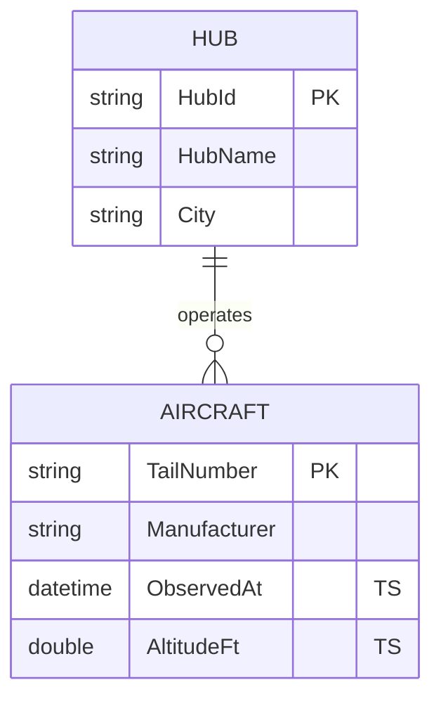
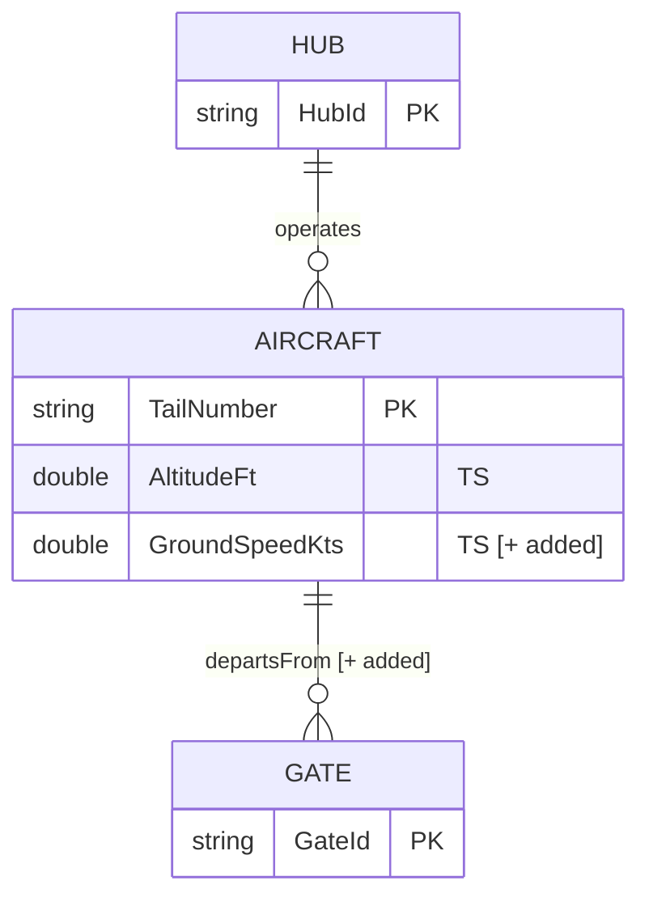

# Preview & Confirm — Author-Time Design Review

> Before invoking `createItem` or `updateDefinition` (the LRO write), the agent **must** render a preview of what's about to be authored and obtain explicit user confirmation. This prevents schema drift, accidental property type changes, and unintended drops of bindings/relationships.

There are two modes:

- **Greenfield** (creating a new ontology, or adding entity/relationship types from scratch) → render a **proposal diagram** showing the planned shape.
- **Brownfield** (updating an existing ontology) → render a **change set** showing added / removed / modified parts vs. the current `getDefinition` snapshot.

Both modes are CLI-friendly: Mermaid for the diagram, plus a plain-text "Affected Parts" table that renders in any chat surface.

---

## 1. Greenfield: proposal diagram

After Step 6 of the authoring workflow (envelope assembled in memory), but **before** Step 7 (LRO write), emit:

### 1a. Header summary

```text
Proposed ontology:  ZavaAirlinesOntology  (in workspace WS_ID, folder FOLDER_ID)
Entity types:       2  (Hub, Aircraft)
Relationship types: 1  (operates: Hub → Aircraft)
Data bindings:      3  (Hub→LH:hubs, Aircraft→LH:aircrafts, Aircraft→EH:AircraftReadings)
Contextualizations: 1  (operates ↔ LH:hub_aircraft_link)
```

### 1b. Mermaid ER diagram



**Conventions for the diagram:**

- One Mermaid block per ontology.
- Each entity type is one `erDiagram` block; key properties get `PK`. `displayNamePropertyId` does not get its own marker (call it out in the header summary if helpful).
- Timeseries properties get the trailing comment `"TS"` so reviewers can see static-vs-timeseries at a glance.
- Relationships render as `||--o{` (one-to-many) by default. If the contextualization link table is composite, add a label `"<rel name> [composite]"`.

### 1c. Affected parts table

```text
| Action | Path                                                               | Why            |
|--------|--------------------------------------------------------------------|----------------|
| ADD    | .platform                                                          | metadata       |
| ADD    | definition.json                                                    | empty envelope |
| ADD    | EntityTypes/<HUB_ET_ID>/definition.json                            | Hub entity     |
| ADD    | EntityTypes/<HUB_ET_ID>/DataBindings/<guid>.json                   | LH binding     |
| ADD    | EntityTypes/<AIRCRAFT_ET_ID>/definition.json                       | Aircraft       |
| ADD    | EntityTypes/<AIRCRAFT_ET_ID>/DataBindings/<guid>.json              | LH static      |
| ADD    | EntityTypes/<AIRCRAFT_ET_ID>/DataBindings/<guid>.json              | EH timeseries  |
| ADD    | RelationshipTypes/<OPERATES_REL_ID>/definition.json                | operates       |
| ADD    | RelationshipTypes/<OPERATES_REL_ID>/Contextualizations/<guid>.json | LH link table  |
```

### 1d. Confirmation prompt

End the preview with **one** of these prompts (do not auto-continue):

> "Confirm this design and proceed with `createItem`? (yes / edit / cancel)"

If the user says `edit`, loop back to Step 1 with their changes; do **not** partially apply.

---

## 2. Brownfield: change-set diff

If the ontology already exists, fetch its current state with `getDefinition` (Step 3 of the workflow) **before** building the proposed envelope. Compare the two and emit:

### 2a. Header summary

```text
Updating ontology: ZavaAirlinesOntology (ONTO_ID=...)
  + 1 entity type added       (Gate)
  ~ 1 entity type modified    (Aircraft: +1 timeseries property)
  - 0 entity types removed
  + 1 relationship added      (departsFrom: Aircraft → Gate)
  ~ 0 relationships modified
  - 0 relationships removed
```

### 2b. Mermaid diagram with change markers

Render the **post-update** diagram, but annotate changed elements with a comment suffix:



Suffix convention:

- `[+ added]`   — new property / binding / entity / relationship
- `[~ modified]` — existing element whose definition changed (e.g., property valueType, binding sourceTable)
- `[- removed]`  — element being deleted

### 2c. Affected parts table (with action column)

```text
| Action | Path                                                                            | Diff                                  |
|--------|---------------------------------------------------------------------------------|---------------------------------------|
| ADD    | EntityTypes/<GATE_ET_ID>/definition.json                                        | new entity type Gate                  |
| ADD    | EntityTypes/<GATE_ET_ID>/DataBindings/<guid>.json                               | LH binding to dbo.gates               |
| MOD    | EntityTypes/<AIRCRAFT_ET_ID>/definition.json                                    | + timeseriesProperties[GroundSpeedKts]|
| MOD    | EntityTypes/<AIRCRAFT_ET_ID>/DataBindings/<existing-eh-guid>.json               | + propertyBindings[gnd_spd_kts]       |
| ADD    | RelationshipTypes/<DEPARTS_REL_ID>/definition.json                              | new relationship                      |
| ADD    | RelationshipTypes/<DEPARTS_REL_ID>/Contextualizations/<guid>.json               | LH link table                         |
| KEEP   | EntityTypes/<HUB_ET_ID>/...                                                     | unchanged (carried forward in envelope)|
```

`KEEP` rows are **not optional** to surface — `updateDefinition` replaces the entire `parts[]`, so any part that should survive must be re-included in the envelope. Use this column to assure the user that nothing they expect to keep is being silently dropped.

### 2d. Risky-change callouts

Before the confirmation prompt, surface these **explicitly** if any apply:

- **Property `valueType` changed** (e.g., `String` → `BigInt`) — data already loaded against the old type may fail to parse.
- **Entity `entityIdParts` changed** — break-change; downstream consumers will not match identities across the boundary.
- **Binding `sourceTableName` / `sourceSchema` changed** — bindings now point at a different table; verify intent.
- **Removal** of any entity type, relationship type, or binding — confirm explicitly; deletes are not auto-recoverable.

### 2e. Confirmation prompt

> "Confirm and apply this change set with `updateDefinition`? (yes / edit / cancel)"

---

## 3. How to compute the diff

```bash
# Step A — fetch current state (after Step 3 of the workflow)
az rest --method POST \
  --url "https://api.fabric.microsoft.com/v1/workspaces/${WS_ID}/items/${ONTO_ID}/getDefinition" \
  --resource "https://api.fabric.microsoft.com" -o json > /tmp/onto.current.json
# (poll Location, then GET .../result — see COMMON-CLI.md § LRO)

# Step B — decode parts to a directory tree for cmp
mkdir -p /tmp/onto.current.tree
jq -r '.definition.parts[] | "\(.path)\t\(.payload)"' /tmp/onto.current.json |
while IFS=$'\t' read -r path b64; do
  mkdir -p "/tmp/onto.current.tree/$(dirname "$path")"
  printf '%s' "$b64" | base64 -d > "/tmp/onto.current.tree/$path"
done

# Step C — do the same for the proposed envelope before sending
# (the agent already has the parts in memory; dump them under /tmp/onto.proposed.tree)

# Step D — diff
diff -ruN /tmp/onto.current.tree /tmp/onto.proposed.tree
```

The agent should parse this diff (or the in-memory equivalent) into the ADD / MOD / KEEP / DEL rows shown in §2c. The Mermaid output in §2b is generated from the **proposed** tree; the change suffixes come from the diff.

---

## 4. Agent contract

A skill consumer agent **must**:

1. Always render the preview in §1 (greenfield) or §2 (brownfield) before any LRO write.
2. Wait for an explicit `yes` from the user. Treat anything else as `edit` or `cancel`.
3. On `edit`, regenerate the proposal from the user's revised intent — do **not** apply a partial update.
4. On `cancel`, leave the existing ontology untouched and discard the proposed envelope.
5. Persist the **post-write snapshot** alongside the spec in the consumer's repo, so the next run's diff is reliable.

A skill consumer agent **must not**:

- Skip the preview because the change "looks small" — there is no safe threshold.
- Compress KEEP rows into "(no other changes)" — the user must see everything in the post-update envelope, because `updateDefinition` is replace-the-whole-tree.
- Auto-confirm in non-interactive mode without an explicit `--yes` flag from the caller. If the caller didn't say yes, ask.
